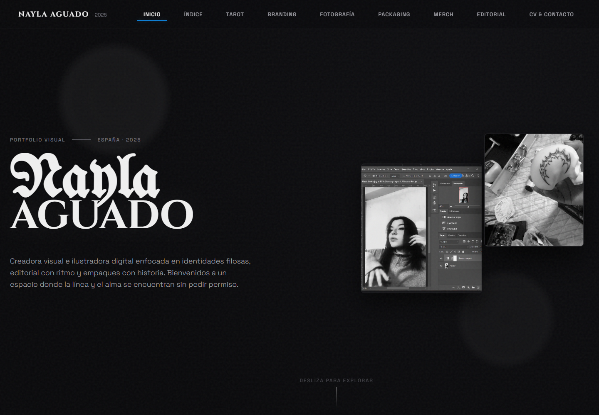

# Portfolio de Nayla Aguado

Portfolio visual de Nayla Aguado, centrado en ilustracion, identidad, fotografia, packaging y diseno editorial. La web organiza los proyectos en una experiencia de navegacion continua con animaciones y composiciones adaptadas a cada coleccion.



## Desarrollo local

Requiere Node.js 18 o posterior.

```bash
npm ci
npm run dev
```

Para comprobar la version de produccion:

```bash
npm run build
npm run preview
```

## Tecnologia

- React y TypeScript
- Vite
- Framer Motion y Lenis
- CSS Modules

## Arquitectura

La aplicacion Vite compone el portfolio con secciones y componentes React que consumen contenido y recursos locales. No existe backend: el build genera archivos estaticos y las animaciones se aplican en el cliente sin alterar la estructura del contenido.

## Documentacion

La [documentacion en DeepWiki](https://deepwiki.com/eneekoruiz/portfolio_nayla) ofrece una vista adicional de la estructura y el codigo del proyecto.
